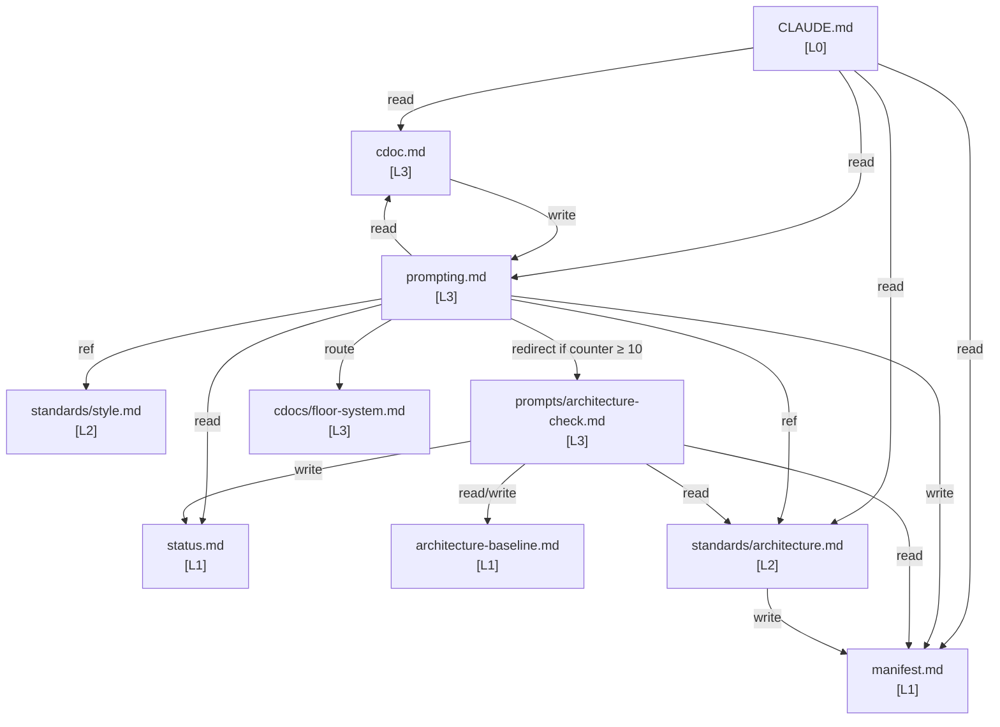
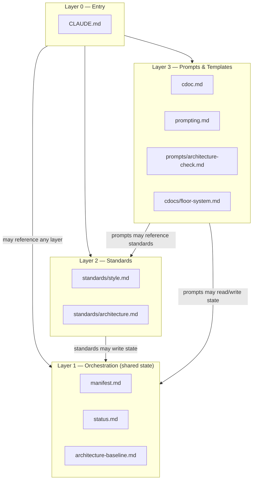
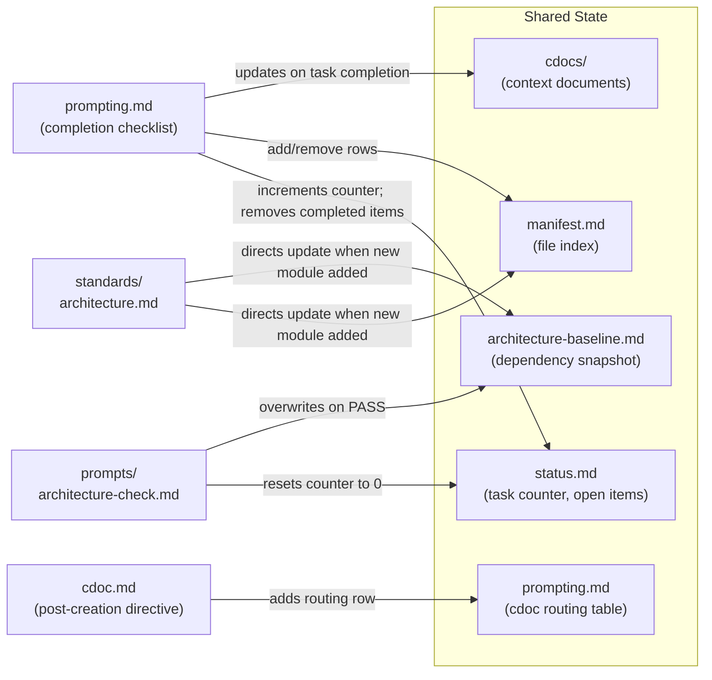

# Architecture Baseline — Floor

Generated: 2026-04-02
Initial run — no prior baseline.

---

## Module Summary

| File | Layer | Lines | Single Responsibility |
|------|-------|-------|-----------------------|
| `floor/CLAUDE.md` | T0 — Template Entry | 25 | Template session entry point (mirrors CLAUDE.md) |
| `floor/setup.md` | T-Bootstrap | 70 | One-time setup checklist; deleted after setup is complete |
| `floor/project_management/manifest.md` | T1 — Template Orchestration | 28 | Template file index |
| `floor/project_management/status.md` | T1 — Template Orchestration | 28 | Template work tracking |
| `floor/project_management/cdoc.md` | T3 — Template Prompts | 9 | Template cdoc creation instructions |
| `floor/project_management/prompting.md` | T3 — Template Prompts | 33 | Template task prompt composition instructions |
| `floor/project_management/standards/style.md` | T2 — Template Standards | 88 | Template style guide (placeholder-driven) |
| `floor/project_management/standards/architecture.md` | T2 — Template Standards | 96 | Template architecture conventions (placeholder-driven) |
| `floor/project_management/prompts/architecture-check.md` | T3 — Template Prompts | 76 | Template architecture health check prompt |

---

## Diagram 1 — Module Dependency Graph (Project Meta Layer)

Edges represent read directives (`→ read`), write directives (`→ write`), or routing/conditional references (`→ ref`).

---

## Diagram 2 — Layered Architecture

Arrows show the permitted reference direction (downward only; no L2 → L3 allowed).

---

## Diagram 3 — State Mutation Flow

Shows which agents (prompt files) are authorized to mutate each piece of shared state.

---

## Diagram 4 — User Task Flow (Template User Workflow)

Sequence showing a developer who has adopted Floor in their project completing a new task.

```mermaid
sequenceDiagram
    participant U as Developer
    participant C as Claude
    participant PM as prompting.md
    participant ST as status.md
    participant AC as architecture-check.md
    participant CD as cdoc.md
    participant M as manifest.md

    U->>C: Open session / request new task prompt
    C->>PM: read prompting.md
    C->>ST: check Task Counter

    alt Counter < 10 — normal task
        C->>C: select relevant cdocs from routing table
        C->>C: compose task prompt<br/>(manifest read directive, standards refs, cdoc refs)
        C->>U: output task prompt
        Note over U,C: [New session] Task executes
        U->>C: "Task is done"
        C->>ST: remove item&#59; increment counter
        C->>M: add rows for new files&#59; remove rows for deleted files
        C->>CD: read cdoc.md
        C->>C: update relevant cdocs
        C->>U: Remind to git commit
    else Counter ≥ 10 — health check due
        C->>AC: load architecture-check.md
        C->>U: output architecture health check prompt
        Note over U,C: [New session] Health check executes
        C->>ST: reset counter to 0
        C->>M: update architecture-baseline.md entry if new
    end
```

